# LIDAR Obstacle Detector

## 1. Overview
LiDAR (Light Detection and Ranging) is a laser-based sensing technology that provides highly accurate 3D information about the environment. Unlike cameras, which rely on ambient light and are sensitive to lighting conditions, LiDAR actively emits up to millions of infrared laser pulses across a wide field of view—often 360 degrees—and measures the time it takes for each pulse to return after reflecting off objects. This allows for highly precise distance measurements, regardless of lighting or shadows.

In addition to range, LiDAR sensors capture intensity values, which offer clues about the material properties of surfaces. The result is a dense, high-resolution 3D map of the surroundings that is robust in low-light or high-glare conditions—scenarios where cameras may struggle. This makes LiDAR a powerful sensor for enhancing perception and safety in autonomous systems, despite its current high cost.

This project primarily deals with [Lidar](https://en.wikipedia.org/wiki/Lidar) data processing and obstacle detection in a city driving environment. The lidar data is in the form of [point clouds](https://en.wikipedia.org/wiki/Point_cloud), containing xyz coordinates and intensity values from the returned pulses. The point cloud data (PCD) is processed using filtering, segmentation and clustering techniques. Specifically, RANSAC with planar model fitting and KD-Tree based Euclidean clustering are used to segment and cluster the point clouds.

<p align="center">

</p>

## 2. Table of Contents
- [Project Instructions](#build)
- [The Lidar Model and Simulated Point Clouds](#lidar)
- [Real World Point Cloud Data](#realworldPCD)
- [Planar Segmentation](#segmentation)
- [Euclidean Clustering](#clustering)
- [Bounding Boxes](#boxes)
- [Acknowledgements](#acknowledgements)


## 3. Project Instructions <a name="build"></a>
1. Clone this repo with LFS, which can be done in two ways:
	1. `git lfs clone https://github.com/moorissa/lidar-obstacle-detector.git` OR
	2. Alternatively:
		```bash
		git clone https://github.com/moorissa/lidar-obstacle-detector.git
		cd lidar-obstacle-detector  # ensure no duplicated names in the same directory
		git lfs pull
		```
	If LFS continues causing (submission) issues:
   - Upload PCD files to a cloud service (Google Drive, Dropbox) and include download links
   - Use smaller sample PCD files that don't require LFS
   - Compress the PCD files if possible
2. Make a build directory: `mkdir build && cd build`
3. Compile: `cmake .. && make -j`
4. Run it: `./environment`. Check out line 266-268 to run a specific function in the [`src/environment.cpp`](src/environment.cpp)

#### Dependencies
* cmake >= 3.10
  * All OSes: [click here for installation instructions](https://cmake.org/install/)
* make >= 3.8
  * Linux: make is installed by default on most Linux distros
  * Mac: [install Xcode command line tools to get make](https://developer.apple.com/xcode/features/)
  * Windows: [Click here for installation instructions](http://gnuwin32.sourceforge.net/packages/make.htm)
* gcc/g++ >= 5.4
  * Linux: gcc / g++ is installed by default on most Linux distros
  * Mac: same deal as make - [install Xcode command line tools](https://developer.apple.com/xcode/features/)
  * Windows: recommend using [MinGW](http://www.mingw.org/)
* PCL >= 1.10
  * [Documentation](https://pointclouds.org/downloads/)

#### Currently used (2025 version):
* MacOS: Sequoia 15.5
* cmake: 3.31.7
* GNU make: 3.81
* gcc: 
  ```
  Target: arm64-apple-darwin24.5.0
  Thread model: posix
  InstalledDir: /Library/Developer/CommandLineTools/usr/bin
  ```
* pcl: stable 1.15.0


## 4. The Lidar Model and Simulated Point Clouds <a name="lidar"></a>
To simulate the point cloud generation process, a simple lidar model is used. This model takes in parameters such as max and min ray distance, angular resolution, a surrounding cars vector, etc. A set of rays are generated using these parameters. The lidar scan function implements raycasting where each of these rays are checked for collision with other cars or the ground plane. The scan function returns a point cloud with some Gaussian noise added in. A simple highway scene that explains this is shown below.

<p align="center">
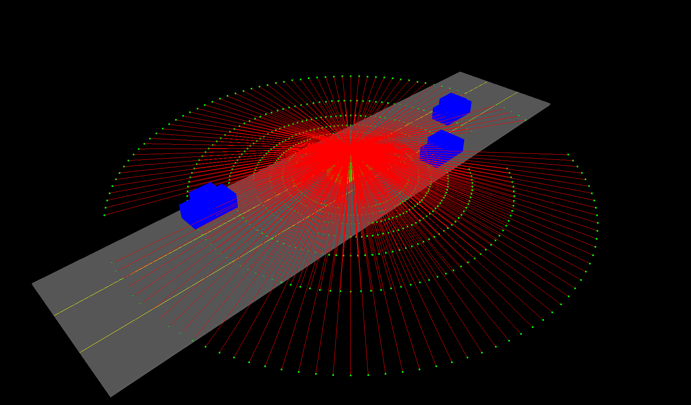
</p>

## 5. Real World Point Cloud Data <a name="realworldPCD"></a>
The different point cloud processing techniques described in the subsequent section can be applied to the simulated set of point clouds that are obtained using the previously described lidar model. This can serve as a simplified learning experience and can be used to debug and the different algorithims involved. However going forward, these techniques will be applied on real world PCD data obtained from an actual lidar. 

Also, the same techniques used to process a single point cloud dataset is then extended to process a stream of incoming point clouds.

<p align="center">
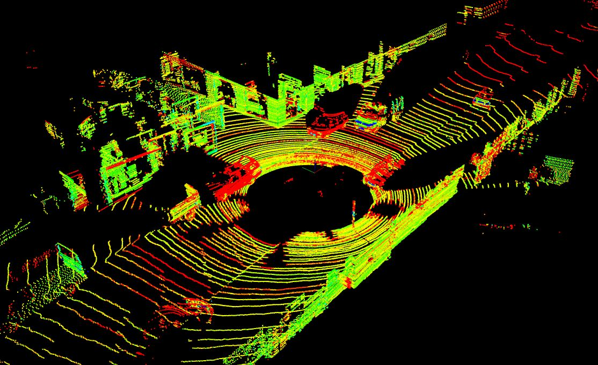
</p>

The image above shows a high resolution point cloud that spans a large distance. In order for the processing pipeline to be able to digest the data as quickly as possible, the point cloud will have to be filtered down. There are two key techniques involved here:

### 1. Voxel Grid Filtering
Voxel Grid Filtering is a downsampling method for point clouds. This technique utilizes a voxelized grid approach to reduce the number of points in the dataset. It first creates a 3D voxel grid (a voxel can be thought of a small 3D box in space that uses a lot less memories than individual point clouds), with the resolution being controlled by input parameters. The resolution should be low enough to help speed up processing, but not so low that object definition is completely lost. Then, all the points in each of these voxels will be approximated with their centroid. 

#### Why is downsampling important?
Due to the high volume of data generated, transmitting raw LiDAR point clouds across a vehicle’s internal network is inefficient. To address this, the data is downsampled and converted into a more compact representation known as stixels—short for “stick” and “pixel”. Originally developed for stereo camera processing, stixels are vertical rectangular segments (like matchsticks) that approximate object surfaces in the scene.

### 2. Region of Interest Cropping
The lidar scan extends over a large distance from the ego vehicle. This can be cropped to retain only useful information and hence reduce processing time. An appropriate region of interest includes a good amount of space in front of the ego vehicle so that it is able to react quickly in time to any obstacles moving towards it. For the sides, at least the width of the road should be covered. It would also be beneficial to remove points that are hitting the roof of the ego car. 

The filtered and cropped point cloud data is shown below.

<p align="center">
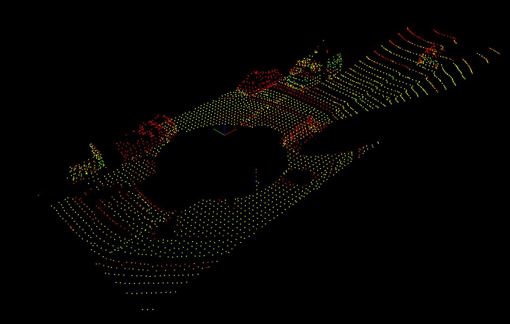
</p>

### Point Cloud Preprocessing Guidelines

To get the best results from your point cloud processing pipeline, consider the following adjustments:

1. Voxel Grid Downsampling
	* Use a voxel size large enough to improve performance, but small enough to preserve object shapes.
	* Start with values like 0.2m or 0.3m, and tune based on your scene and processing speed.

2. Region of Interest (ROI)
	* Define a region that captures:
	* Enough space in front of the vehicle to detect and react to approaching obstacles.
	* Road width on both sides to detect nearby objects or vehicles.
	* Ensure all critical obstacles are within the ROI for effective perception.

3. Camera Views (Optional)
	* Adjust camera angles in [`environment.cpp`](src/environment.cpp) to help choose and visualize your ROI.
	* Use a top-down view for layout context.
	* Use a side view to inspect vertical filtering and bounding boxes.

4. Remove Ego Vehicle Roof Points
	*	Use `pcl::CropBox` to isolate the ego car’s roof point indices.
	*	Pass those indices to `pcl::ExtractIndices` to remove them, just like in point cloud segmentation.
	*	This helps prevent false detections from the car’s own structure.

5. Debug with Bounding Boxes
	*	Use the `renderBox` function to visualize the size and placement of bounding boxes in the scene.
	*	Helpful for checking if your ROI, voxel size, and filtering logic are working as intended.


## 6. Point Cloud Segmentation <a name="segmentation"></a>
One of the key objectives of lidar point cloud processing is to separate the road plane from potential obstacles. If the road is flat it’s fairly straightforward to pick out road points from non-road points. To achieve this, planar segmentation based on the random sampling consensus (RANSAC) algorithm is used. 

<!-- <p align="center">
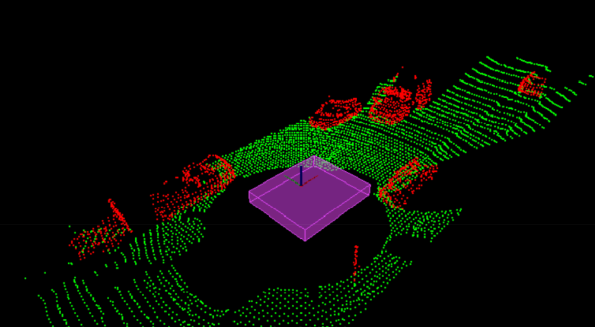
</p> -->


### RANSAC (Random Sample Consensus) Plane Segmentation
RANSAC stands for random sampling consensus and is a method for detecting outliers in data. The algorithm runs for a set number of iterations and returns the model that best fits the data. Each of these iterations randomly picks a subset of data and fits a model such as a line or plane through it. The iteration with the highest number of inliers or lower noise is then used as the best model. To be precise, here is a step-by-step instruction to detect obstacles in a point cloud scene by separating them from the road surface (which is not an obstacle).

1. Assumptions:
    * Use RANSAC-based Planar Segmentation to find the road, assuming it’s flat.
    * The largest planar surface is assumed to be the road.

2. Implementation Overview - use the `ProcessPointClouds class` in [`processPointClouds.cpp`](src/processPointClouds.cpp) for:
    * Filtering
    * Segmentation (using RANSAC)
    * Clustering
    * Loading/saving PCD files

4. Steps:
	* Implement the `SegmentPlane` function:
	    * Set maxIterations and distanceThreshold for RANSAC.
	    * Extract inliers (points that lie on the road plane).
	* Implement the `SeparateClouds` function:
	    * Use PCL’s `ExtractIndices` to separate roadCloud (inliers) from obstacleCloud (non-inliers)

5. Output (visualization of segmented point clouds):
    * Road = one cloud (e.g. green)
    * Obstacles (e.g. cars, trees) = another cloud (e.g. red)


There are different variations to the RANSAC algorithm. One type selects the smallest possible subset of points to fit. For a line, that would be two points, and for a plane three points. Then the number of inliers are counted, by iterating through every remaining point and calculating its distance to the model. The points that are within a certain distance to the model are counted as inliers. The iteration that has the highest number of inliers is then the best model

Other methods of RANSAC could sample some percentage of the model points, for example 20% of the total points, and then fit a line to that. Then the error of that line is calculated, and the iteration with the lowest error is the best model. This method might have some advantages since not every point at each iteration needs to be considered. It’s good to experiment with different approaches and time results to see what works best. The following graphic shows a 2D RANSAC algorithm

<p align="center">

</p>

The output of the planar segmentation process is a pair of point clouds - one that represents the road and the other than represents obstacles. The segmented PCD data is shown below.

<p align="center">
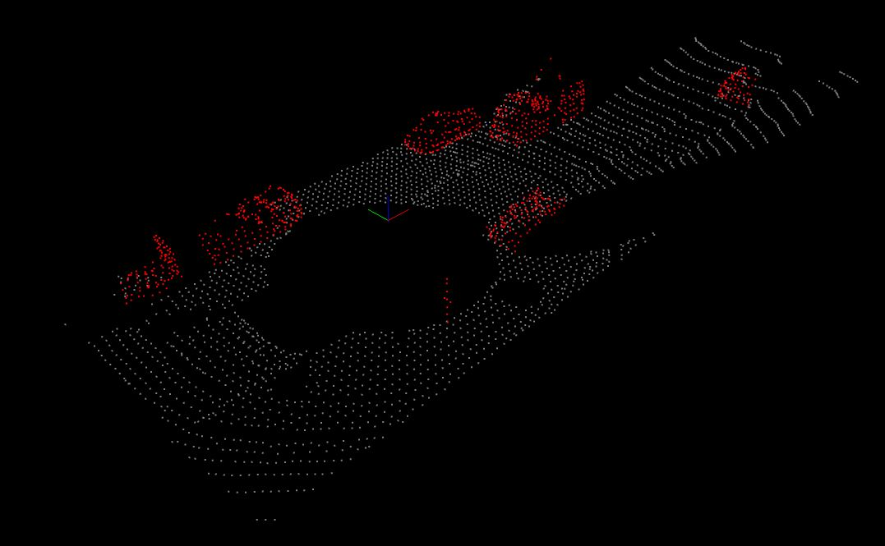
</p>


## 7. Euclidean Clustering <a name="clustering"></a>
Once the obstacles and road points have been segmented, the next step is to cluster the points that represent the different obstacles. Clustering is like drawing boundaries across a group of points and group them as an object eg “car” or “pedestrian”, and in essence different from segmentation in the following ways.

| **Aspect**     | **Segmentation**   | **Clustering**   |
|---|---|---|
| **Goal** | Divide the data based on structure or model | Group points based on proximity|
| **Example Use** | Separate road vs. obstacles (e.g. using a plane model)  | Identify and label each object (car, person, etc.)   |
| **How** | Often uses model fitting (e.g., RANSAC for planes)   | Uses spatial distance (e.g., Euclidean clustering)    |
| **Result** | Logical separation (e.g. road vs. not-road)         | Individual object-level separation (e.g. 3 cars)    |
| **Output** | Usually 2 groups: inliers (fit the model) and outliers  | Multiple groups (clusters), no model needed  |

One way to perform clustering is using the Euclidean clustering algorithm. The idea is to create association between groups of points depending on how close they are. This involves performing a nearest neighbor search and to do this efficiently, a data structure such as a `KD-Tree` is required. 


### KD-Tree Implementation
A KD-Tree is a K-dimensional binary search tree that organizes data spatially by splitting points between alternating dimensions. By doing this, KD-Tree enables efficient nearest neighbor search with a time complexity of O(log(n)) as opposed to O(n). This is primarily because, by grouping the points into regions in a KD-Tree, the search space is narrowed down drastically and expensive distance computations for potentially thousands of points can be avoided. The algorithm used to construct a KD-Tree is explained [here](https://www.geeksforgeeks.org/k-dimensional-tree/). The 2D points before and after spacial splitting are shown below. Here, the blue lines indicate X dimension splits and red lines indicate Y region splits

<p align="center">
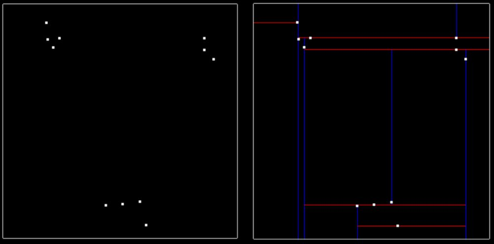
</p>

Once points are able to be inserted into the tree, the next step is being able to search for nearby points inside the tree compared to a given target point. Points within a distance tolerance are considered to be nearby. 

The naive approach of finding nearby neighbors is to go through every single point in the tree and compare their distances with the target, selecting point indices that fall within the distance tolerance of the target. 

Instead with the KD-Tree, a boxed square of size 2 X distance tolerance, centered around the target point is used. If the current node point is within this box, only then the Euclidean distance is calculated and depending on this, it can be determined if the point should be added to the list of nearby points. Further, if this box does not cross over the node division region, the branch on the other side of the region is completely skipped. If it crosses over, then that side is recursively explored. This is shown in the image below. The red crosses indicate regions which were entirely skipped.

<p align="center">
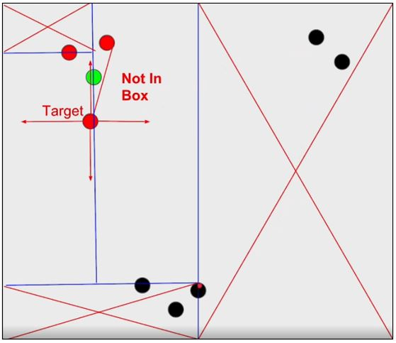
</p>

Once the KD-Tree method for searching nearby points is implemented, the next step is to implement a euclidean clustering method that groups individual cluster indices based on their proximity. Inside [`cluster.cpp`](src/quiz/cluster/cluster.cpp) there is a function called `euclideanCluster` which returns a vector of vector ints, this is the list of cluster indices.
1. To perform the clustering, iterate through each point in the cloud and keep track of which points have been processed already. 
2. For each point add it to a list of points defined as a cluster, then get a list of all the points in close proximity to that point by using the search function from the previous exercise. 
3. For each point in close proximity that hasn't already been processed, add it to the cluster and repeat the process of calling proximity points. 
4. Once the recursion stops for the first cluster, create a new cluster and move through the point list, repeating the above process for the new cluster. 
5. Once all the points have been processed, there will be a certain number of clusters found, return as a list of clusters.

The clustered 2D space is shown below.

<p align="center">
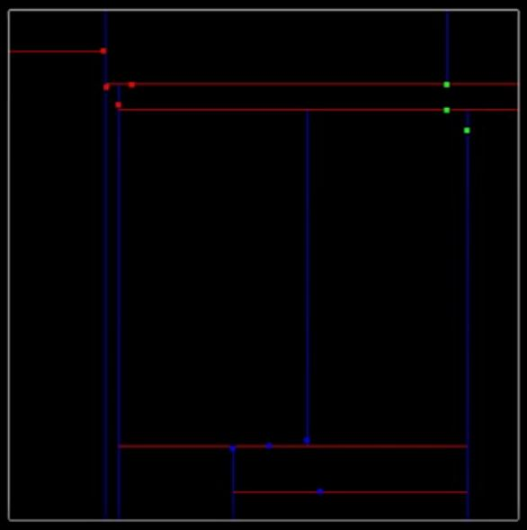
</p>

The clustered real world PCD data is shown below.

<p align="center">
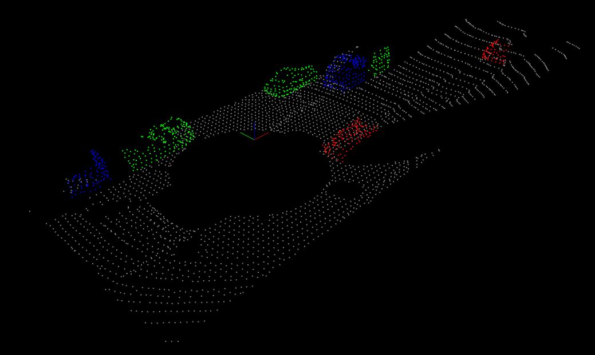
</p>


### How to improve the tree
To optimize search performance in a k-d tree, it’s important to keep the tree balanced by evenly dividing the point space during insertion. This is achieved by alternating splits between the x and y axes and always inserting the median point along the current axis.

For example, given the following four 2D points:
```python
(-6.3, 8.4), (-6.2, 7), (-5.2, 7.1), (-5.7, 6.3)
```
We would insert the points in this order:
	1.	(-5.2, 7.1) – median of the x-values (first x-split)
	2.	(-6.2, 7) – median of the remaining points sorted by y (y-split)
	3.	(-5.7, 6.3) – x-split (lower median of remaining two)
	4.	(-6.3, 8.4) – last point

Choosing medians at each level ensures that the regions are split as evenly as possible, resulting in a well-balanced tree and significantly faster nearest-neighbor or range queries.


## 8. Bounding Boxes <a name="boxes"></a>
As a final touch, bounding boxes can be added around the clusters. The bounding box volume could also be thought of as space the car is not allowed to enter, or it would result in a collision.

<p align="center">
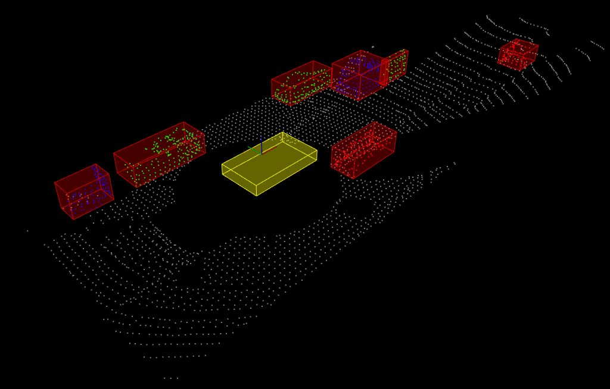
</p>

In this method of generating bounding boxes, the boxes are always oriented along the X and Y axis. This is acceptable if the cluster has the majority of its points oriented along these axes. However, if the cluster has a very long rectangular object at a 45 deg angle to the X axis, then the resulting bounding box would be unnecessarily large and would constrain the ego vehicle's available space to move around

<p align="center">
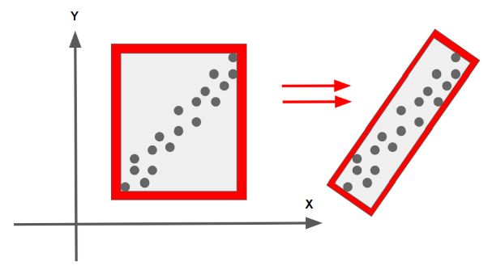
</p>

In the image above, the bounding box on the right and is more efficient, taking into account the rotation about the Z axis and containing all the points with the minimum area required. This project does not include code for generating such a box, but techniques like [principal components analysis](https://en.wikipedia.org/wiki/Principal_component_analysis) can be used to identify the primary axis of the points and a quaternion member can be used for the rotation


## 9. Ackowledgements <a name="acknowledgements"></a>
* [Udacity Sensor Fusion Program](https://www.udacity.com/course/sensor-fusion-engineer-nanodegree--nd313)

For any questions or feedback, feel free to email [moorissa.tjokro@columbia.edu](mailto:moorissa.tjokro@columbia.edu).


